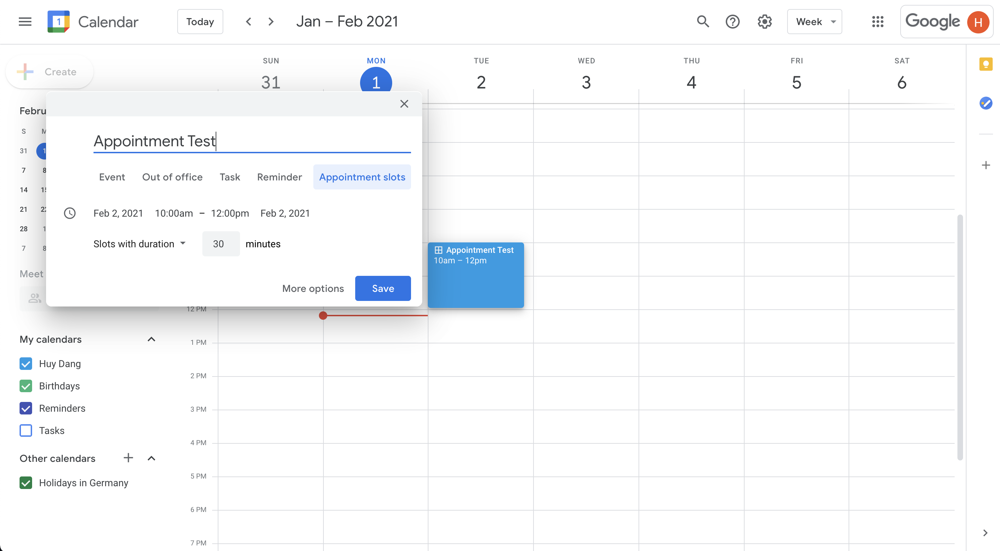
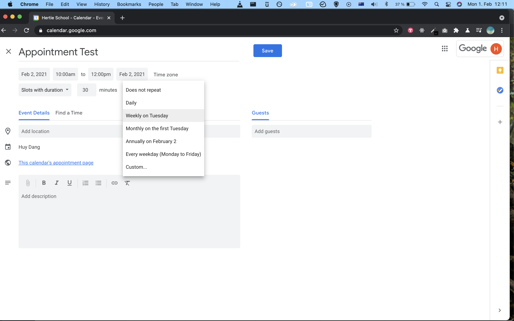
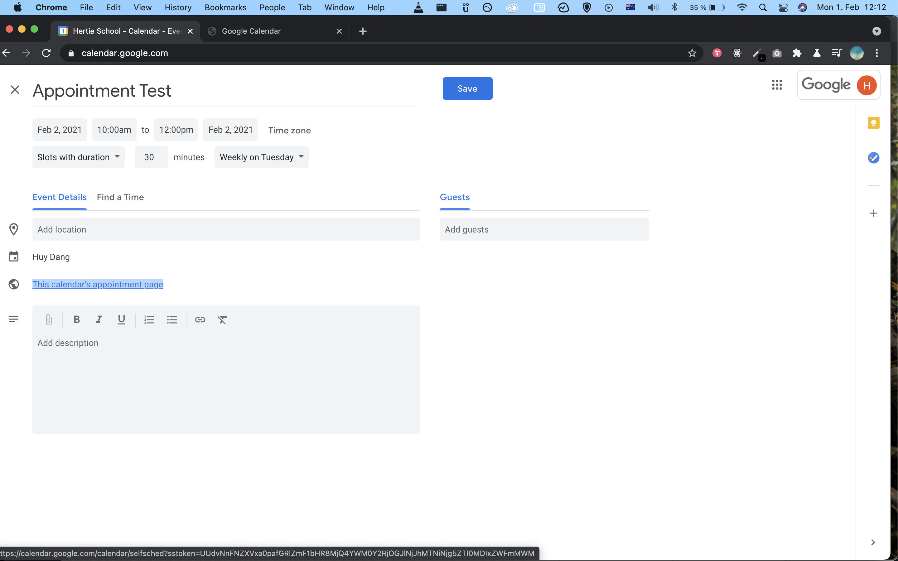
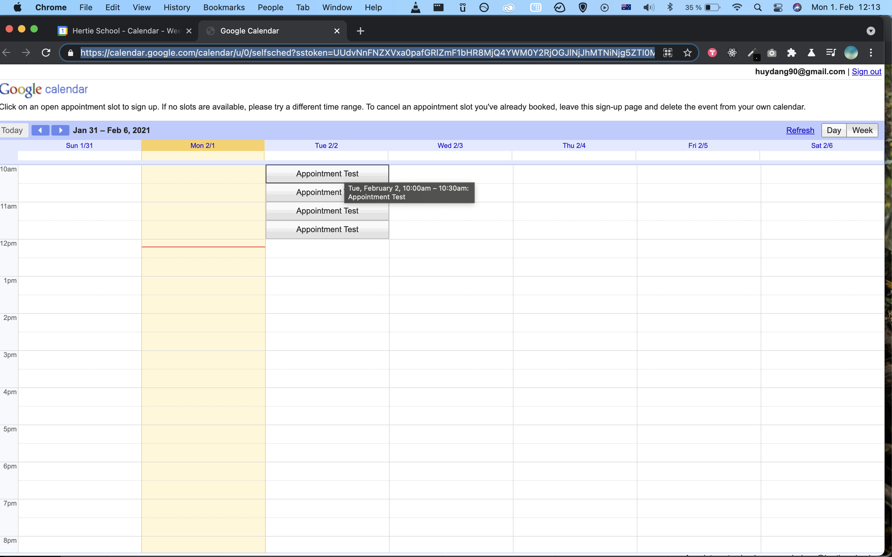
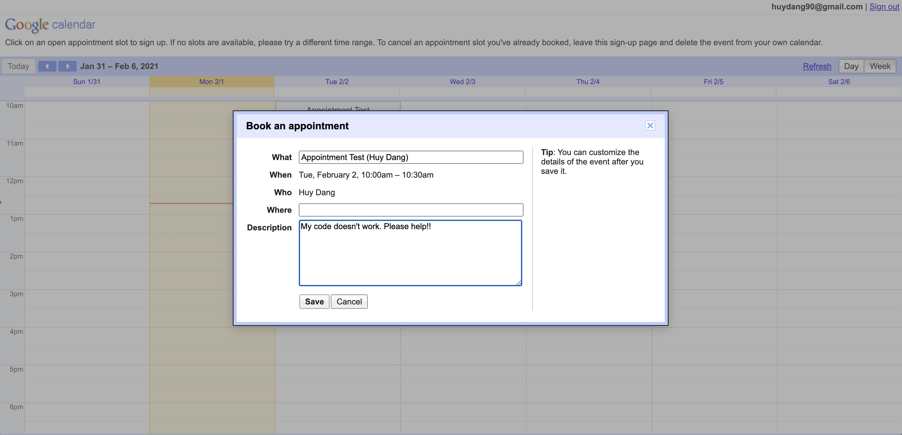
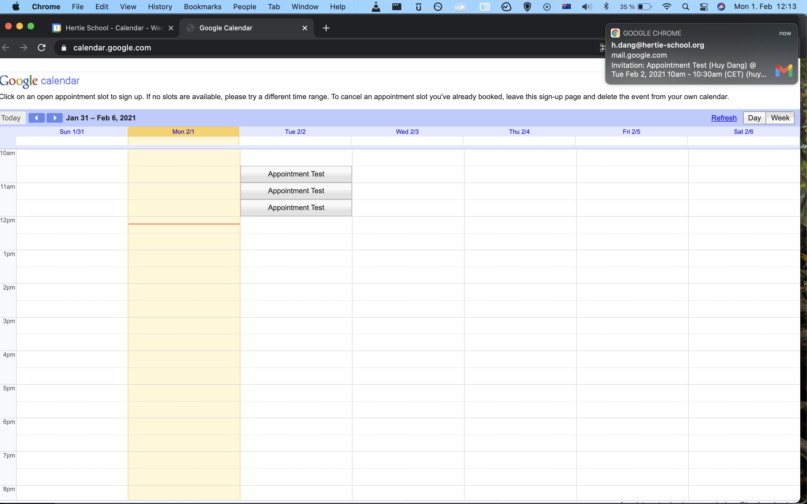
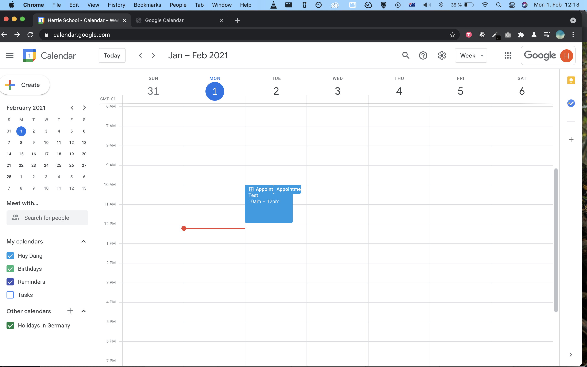
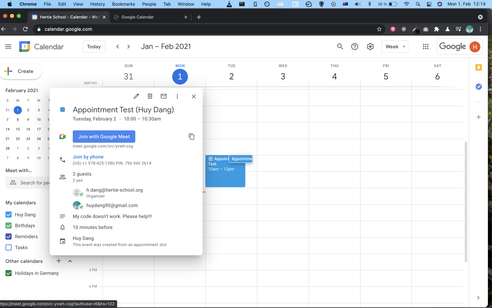
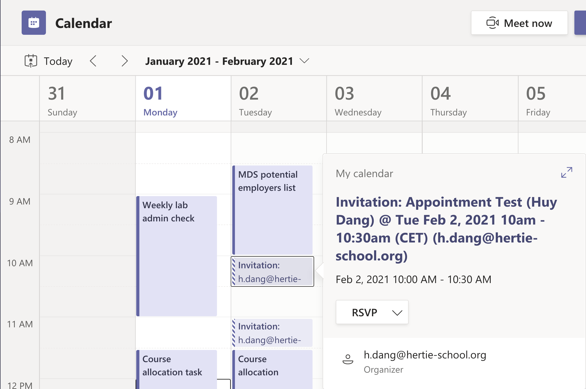
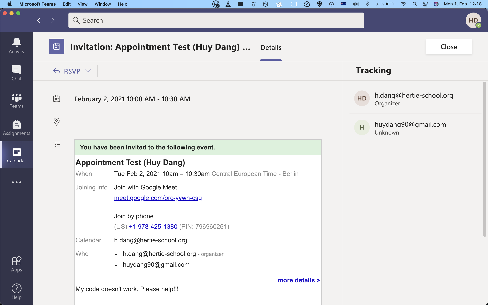

<b><a href="#office-hour-appointment-slots">Office Hour Appointment Slots</a></b>
|
<b><a href="#google-classroom">Google Classroom</a></b>

# Gsuite For Education Services 

G Suite for Education is a suite of free Google tools and services that are tailored for instructors and students. It is different from the usual Google services in that G Suite for Education does not collect students and instructors' data for advertising purposes. There is no indexing of files stored on G Suite and it is in compliance with all data protection and privacy laws. There are many different premium services in the package and we will highlight and continuously update some potential use for the Hertie School here.

### Office Hour Appointment Slots

You can set up an easy and automated office hour appointment system with Google Calendar. To use, please go to https://calendar.google.com/ and sign into the account with your Hertie credentials. 

## Instructor's View

You can create a time block for your office hour as seen below, and specifying the duration of each appointment slots. To make it a repeated time block, please click on More Options. 

On the More Options page, you can choose to repeat the time block according to your need. 

After saving the time block, there will be a link named This calendar's appointment page. You can share this link with your students or on your course' Moodle page so students can sign up for an office hour appointment. 

## Students' View

Below is the students' view of the available office hour slots. They can choose to sign up for the time that is suitable for them. 

They can also put in a short description of what they need to discuss with you. 

After they have saved the slot, it will disappear from the available office hour slots. If they cancel, the slot will be available again for others. A Google Meet link will be automatically created and shared with both the students and you. 

## Instructor's View

After the students have signed up for the slots, if you check your calendar, you can see the sign-up. 

Clicking on the appointment slot, you can see who has signed up, what their issue is, and the Google Meet link to connect with them when the appointment time comes. 

The meeting will also be updated automatically in your Microsoft Teams calendar.

### Google Classroom

You can also use Google Classroom just as a Moodle course page (to be updated).